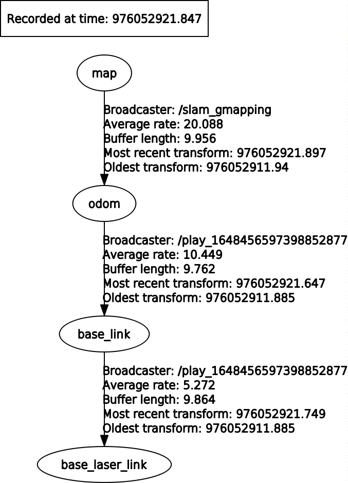

slam_gmapping [](https://travis-ci.org/ros-perception/slam_gmapping)
================================================================================================================================================================

* [gmapping (ROS Wiki)](https://wiki.ros.org/gmapping)

---


# Build

```sh
mkdir ws_2dslam/src
git clone <xxx>
cd ..
catkin_make -j4
```

# Run with dataset

## get bag file

```sh
cd dataset
wget http://ais.informatik.uni-freiburg.de/slamevaluation/datasets/intel.clf
python ../scripts/clf2bag.py
```

## run

```sh
rosbag play --clock intel.bag

rosparam set use_sim_time true
rosrun gmapping slam_gmapping [scan:=base_scan]
# or
roslaunch gmapping slam_gmapping_pr2.launch [scan:=base_scan]
```

rosgraph

<p align="center">
  
</p>

TF tree

<p align="center">
  
</p>

rviz

<p>
  
</p>